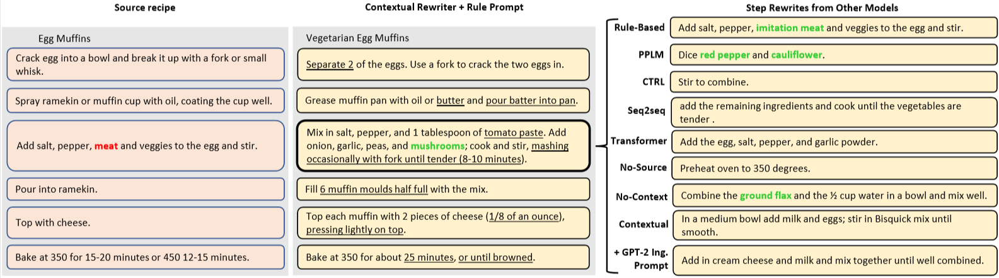

# Recipe Rewriting

This repository contains the code for the EMNLP 2020 paper "Substance over Style: Document-Level Targeted Content Transfer" by Allison Hegel, Sudha Rao, Asli Celikyilmaz, and Bill Dolan ([arXiv](https://arxiv.org/abs/2010.08618)).


## Citation
```
@inproceedings{
Hegel2020Substance,
title={Substance over Style: Document-Level Targeted Content Transfer},
author={Allison Hegel and Sudha Rao and Asli Celikyilmaz and Bill Dolan},
booktitle={Proceedings of the Conference on Empirical Methods in Natural Language Processing (EMNLP)},
year={2020}
```

## Setup

Requirements
* Python 3.6

```bash
pip install -r requirements.txt
```

## Data Preparation

To prepare scraped data for training:
* Scrape recipes or use existing recipe datasets
* Clean recipes and put them in a standard format (see `data_cleaning`)
* Use `make_next_step_data.py` to generate training data formatted for the No-Source Rewriter
* Use `make_next_ing_data.py` to generate training data formatted for the ingredient prompt model
* Use `make_style_transfer_data.py` to generate training data for the Contextual Rewriter model and its ablations

## Using the Model


We fine-tune each model using [HuggingFace](https://huggingface.co/transformers/v2.0.0/examples.html#language-model-fine-tuning).

To create generations for each model, use:
```bash
export NUM_TO_EVAL=0
python evaluation/generate_from_models.py \
    --model <path-to-gpt2-model> \
    --gen_type style_transfer_ing_multi_rule \
    --set test1k \
    --num_to_eval $NUM_TO_EVAL \
    --num_return_sequences 5 \
    --topk 40 \
    --topp 1 \
    --rep 1 \
    --temp 1
```
* NUM_TO_EVAL=0 runs generations using the entire prompt file, while specifying a number will stop after that many lines
* The gen_type above uses our best model; other gen_types give ablations of our best model

## Baselines
In the paper, we compare to several baseline models:
* [PPLM](https://arxiv.org/abs/1912.02164) (see `pplm` folder for implementation details)
* [CTRL](https://arxiv.org/abs/1909.05858) (see `ctrl` folder for implementation details)
* [Seq2seq with copy](https://arxiv.org/abs/1707.01161) ([code](https://github.com/harsh19/Shakespearizing-Modern-English))
* [Transformer](https://arxiv.org/abs/1706.03762) ([code](https://github.com/gooppe/transformer-summarization))

## Evaluation
Code for evaluating the models in terms of perplexity, diversity, and dietary constraint adherence is in `evaluation`.



## Contributing

This project welcomes contributions and suggestions.  Most contributions require you to agree to a
Contributor License Agreement (CLA) declaring that you have the right to, and actually do, grant us
the rights to use your contribution. For details, visit https://cla.opensource.microsoft.com.

When you submit a pull request, a CLA bot will automatically determine whether you need to provide
a CLA and decorate the PR appropriately (e.g., status check, comment). Simply follow the instructions
provided by the bot. You will only need to do this once across all repos using our CLA.

This project has adopted the [Microsoft Open Source Code of Conduct](https://opensource.microsoft.com/codeofconduct/).
For more information see the [Code of Conduct FAQ](https://opensource.microsoft.com/codeofconduct/faq/) or
contact [opencode@microsoft.com](mailto:opencode@microsoft.com) with any additional questions or comments.

## Trademarks

This project may contain trademarks or logos for projects, products, or services. Authorized use of Microsoft 
trademarks or logos is subject to and must follow 
[Microsoft's Trademark & Brand Guidelines](https://www.microsoft.com/en-us/legal/intellectualproperty/trademarks/usage/general).
Use of Microsoft trademarks or logos in modified versions of this project must not cause confusion or imply Microsoft sponsorship.
Any use of third-party trademarks or logos are subject to those third-party's policies.
